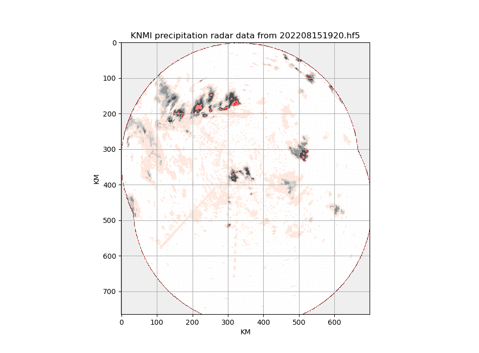

In this repository I've deposited some rough scripts to get you started
using the KNMI precipitation radar data. KNMI is the Dutch national weather
service, and they do a lot of cool research. In addition, they publish a ton
of open data.

# The data
"Gridded files of radar reflectivities at 1500 m over the Netherlands and
surrounding area measured by two radars in Herwijnen and Den Helder.  Time
interval is 5 minutes."

The dataset is described [here on the relevant KNMI open data
page](https://dataplatform.knmi.nl/dataset/radar-reflectivity-composites-2-0).
Some more in-depth stuff, in Dutch only, [is
here](https://www.knmidata.nl/data-services/knmi-producten-overzicht/radar-producten/data-product-1).

KNMI publishes [many more
datasets](https://dataplatform.knmi.nl/organization/knmi) as well. 

There is also information on [how to access the data through the
API](https://developer.dataplatform.knmi.nl/). Some functionality requires
an [API
key](https://developer.dataplatform.knmi.nl/get-started#obtain-an-api-key),
which the system can generate for you in realtime, but you can also use two
generic keys provided there.

# Actually accessing radar reflectivity data
This is a two-step process. First, get a KNMI API key, or use one of the
generic keys, and put it in `knmi.key`.

Then run something like:

```
wget --header "Authorization:$(cat knmi.key)" \
https://api.dataplatform.knmi.nl/open-data/v1/datasets/radar_reflectivity_composites/versions/2.0/files/RAD_NL25_PCP_NA_202208151620.h5/url
```

There is a new file every 5 minutes, and the timestamp '202208151620' is the
15th of August 2022, 16:20 UTC.  This call requests the URL to actually retrieve
this file, and this is returned as JSON, in the field
`temporaryDownloadUrl`.  You could retrieve the actual file like this (if
you have `wget` and `jq`):

```
wget $(jq -r .temporaryDownloadUrl < url)
```

# HDF5
The radar reflectivity data is not "just a picture", it is a HDF5 file, a
format often used for scientific or space data.  HDF5 is complex stuff, and
it can do many things.

If you are into Python, [h5py](https://www.h5py.org/) works well with the
KNMI data and with Matplotlib. 

In [knmi-precip-radar-script.ipynb](knmi-precip-radar-script.ipynb) you'll find a simple
Jupyter notebook that reads an
hour of data from the KNMI API using the operational test key, and turns
that into this fun animation:



